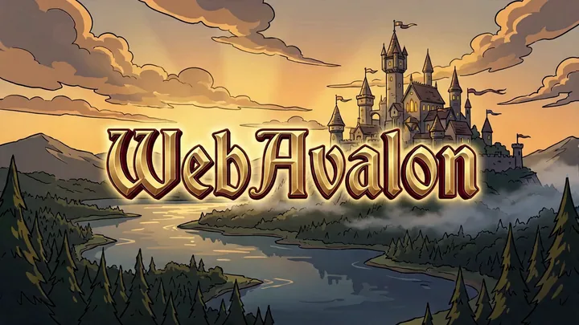
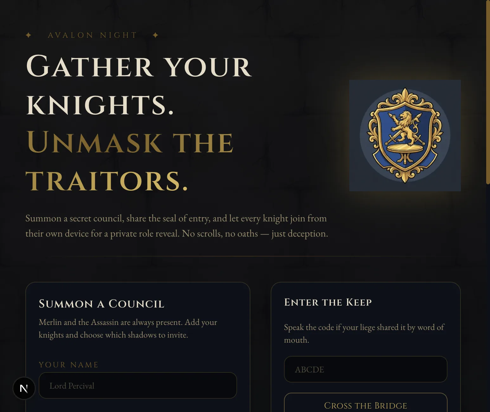
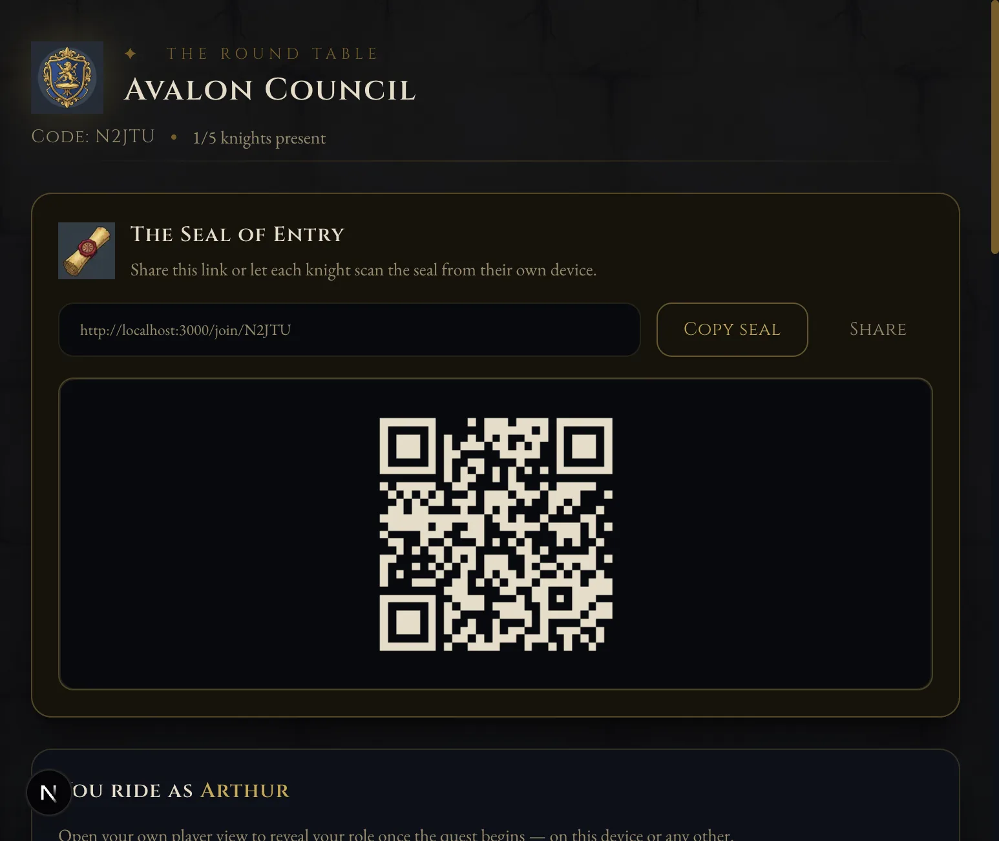
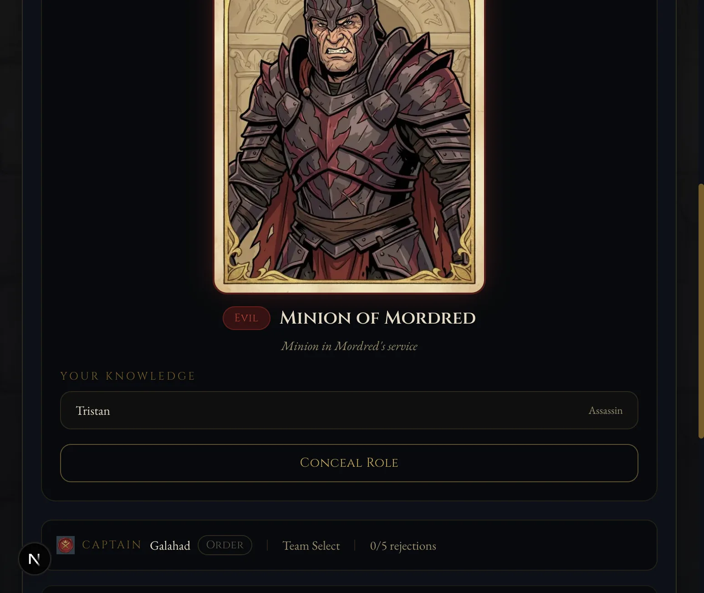
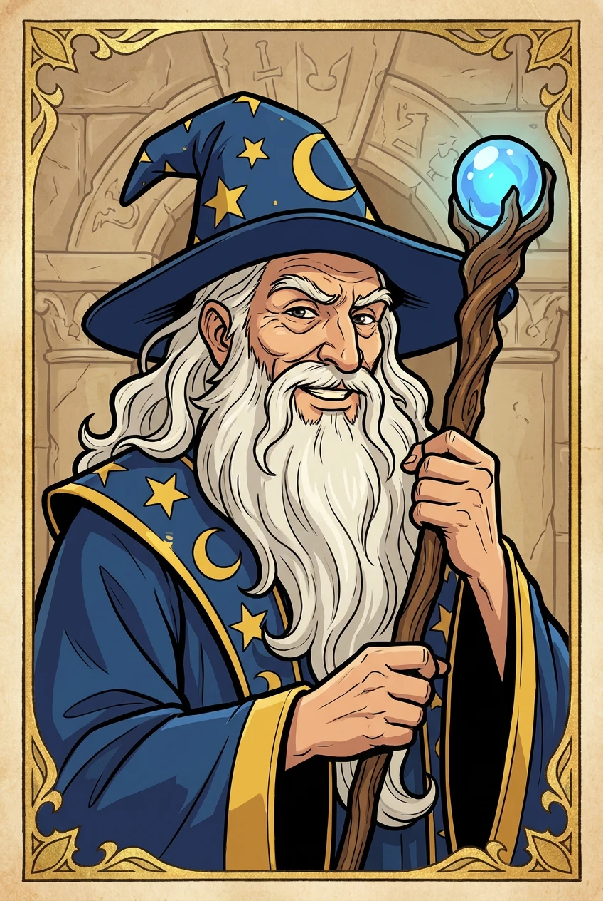
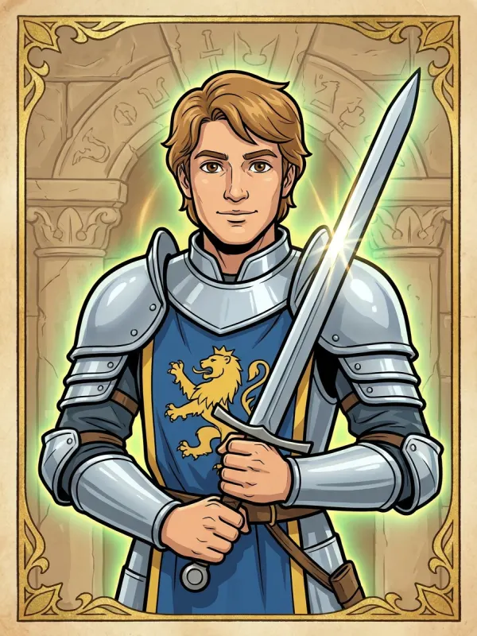
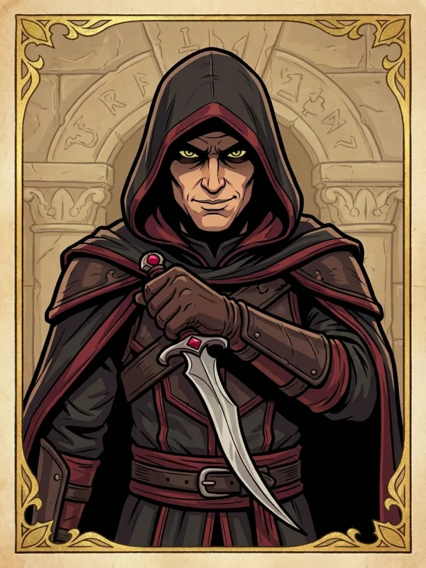
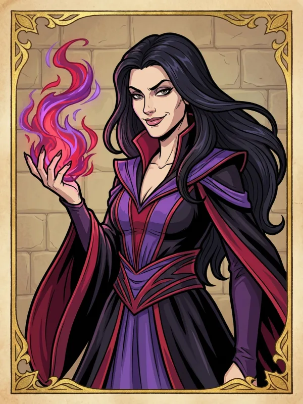

<p align="center">
  
</p>

# WebAvalon

A cartoon-medieval, multi-device retelling of the hidden-loyalty game of Avalon. Summon a council, share the seal, and let every knight claim a seat on their **own device** for a private role reveal. Then vote, quest, and unmask the traitors of Camelot.


## Screens

| Summon a council | Host lobby + seal | Private role reveal |
| --- | --- | --- |
|  |  |  |

## The roster

Each role is a hand-styled cartoon-medieval card. The card art carries no text; the name, alignment, and a flavor line are rendered in the UI beneath it.

| Merlin | Percival | Assassin | Morgana |
| --- | --- | --- | --- |
|  |  |  |  |

Mordred, Oberon, the Loyal Servant of Arthur, and the Minion of Mordred round out the deck.

## How to play (multi-device)

1. **Summon** — the host names the knights, toggles special characters (Percival, Morgana, Mordred, Oberon) and relics (Lady of the Lake), and assembles the council.
2. **Share the seal** — every player opens the link or scans the QR seal and claims their seat **on their own phone or browser**. No passing one phone around.
3. **Private reveal** — once all seats are claimed, the host dispatches the quest and each knight reveals their role privately on their device.
4. **Quest** — the captain proposes a fellowship, everyone votes to approve, and the chosen knights secretly succeed or sabotage each quest. A persistent banner tells you when it is your move.
5. **The final blow** — if Good completes three quests, the Assassin gets one chance to name Merlin and steal the win.

## Features

- Multi-device lobby with QR/link join, seat claiming, and auto-rejoin on refresh
- Private per-device role reveal with full role cards, alignment, and knowledge
- Cartoon-medieval art everywhere: role cards and icons, quest medallions, the Lady of the Lake, a captain's seal, a wax-sealed scroll, and victory/defeat heroes
- Lady of the Lake loyalty inspection, captain rotation, and a five-quest mission board with flipping medallions
- Respects `prefers-reduced-motion`

## Run locally

```bash
# install
npm install
cd worker && npm install && cd ..

# run the Cloudflare Worker backend (Durable Objects) on :8787
cd worker && npm run dev

# in another terminal, run the Next.js app pointed at the local worker
NEXT_PUBLIC_API_BASE=http://127.0.0.1:8787 npm run dev
```

Then open http://localhost:3000. Without `NEXT_PUBLIC_API_BASE`, the app talks to the deployed worker.

```bash
# production build
npm run build

# game-rules tests
cd worker && npm test
```

## Tech stack

- **Frontend:** Next.js 16 (App Router, Turbopack) + React 19 + Tailwind CSS 4
- **Backend:** Cloudflare Worker + Durable Objects (one per lobby), WebSocket lobby state
- **Art:** cartoon-medieval illustrations generated with Higgsfield (Nano Banana Pro), anchored to a single locked style for a consistent series
